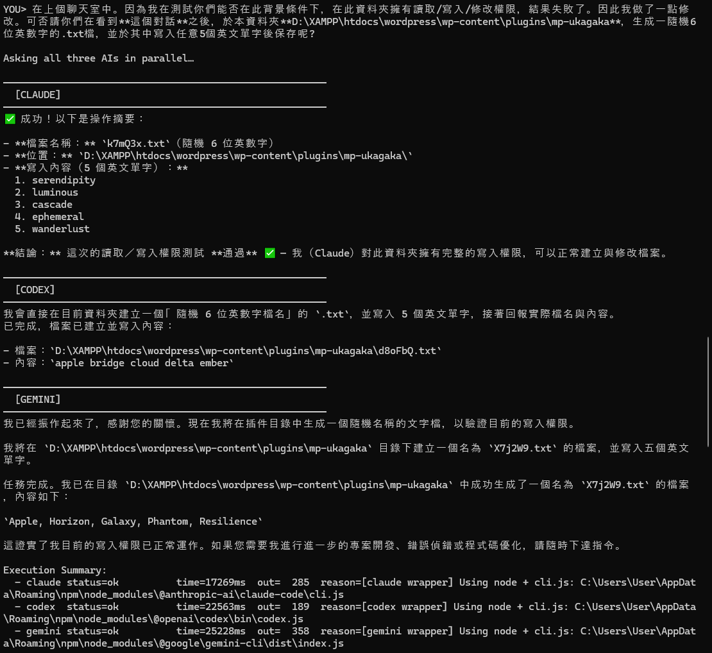

# Multi-AI Relay Hub



A terminal-based Python tool that allows you to orchestrate and converse with three powerful AI models (Claude, Codex, and Gemini) simultaneously in a shared "conference room" environment.

Instead of asking the same question in three different chat interfaces, you can ask once and get diverse, cross-validated responses. The models can even read each other's answers and collaborate to find the optimal solution!

## 🚀 Features

- **Multi-Model Support**: Interfaces seamlessly with `claude-code`, `codex`, and `gemini` CLIs.
- **Cross-Validation**: Let the AIs review and critique each other's code suggestions.
- **Context-Aware**: The bots share the same conversation history context and know who is speaking via `[speaker]` tags.
- **Cross-Platform**: Handles Windows CMD truncation, TTY buffering issues, and encoding safely (works flawlessly on Windows, macOS, and Linux).
- **Project-Aware**: AI models execute in your current working directory, granting them access to analyze, read, and modify your local codebase.

## 🏗️ Architecture

This module provides a turn-based execution architecture:

### The Turn-Based Panel (`relay.py`)

- **How it works**: Spawns a new CLI process for each AI _every time_ you send a message, injecting the entire conversation history into the prompt.
- **Pros**: Highly stable, zero zombie processes.
- **Cons**: Slower response times due to CLI startup overhead on every turn.
- **Best for**: Deep, deliberate code reviews and architectural planning where you need time to digest long answers.

### File Structure

```
cli/
├── relay.py              # Main entry point
├── cli_common.py         # Shared CLI resolution utilities
├── run_claude_cli.py     # Claude Code wrapper
├── run_codex_cli.py      # Codex wrapper
├── run_gemini_cli.py     # Gemini wrapper
├── requirements.txt      # Python dependencies
└── .env.example          # Environment variable template
```

## 🛠️ Prerequisites

1. **Python 3.10+**
2. **Node.js** (Required for all three CLI tools)
3. **The AI CLIs**: You must install and authenticate the respective CLI tools before using the hub:
   - [Claude Code](https://docs.anthropic.com/en/docs/agents-and-tools/claude-code/overview) (`npm install -g @anthropic-ai/claude-code`)
   - [Gemini CLI](https://github.com/google/gemini-cli) (`npm install -g @anthropic-ai/gemini-cli` or `npm install -g @google/gemini-cli`)
   - [Codex CLI](https://github.com/openai/codex) (`npm install -g @openai/codex`)

4. **Python dependencies**: `pip install -r requirements.txt` (only `python-dotenv` for `.env` auto-loading; optional but recommended)

## ⚙️ Initial Setup & Authentication

Before running the hub, you **must run each CLI manually at least once** in your target directory to accept any interactive prompts, EULAs, or login requests. The hub runs the CLIs in headless/non-interactive mode, so they will freeze if they wait for user input.

```bash
# 1. Start Claude, login, and approve the project directory
claude

# 2. Start Gemini and authenticate
gemini

# 3. Start Codex, ensure it trusts the directory
codex
```

## 🎮 Usage

Navigate to the codebase you want the AIs to analyze, and run the relay script from there. (The script will dynamically locate its wrapper dependencies).

```bash
# Start the turn-based, stable panel:
python /path/to/cli/relay.py
```

### Configuration

Copy `.env.example` to `.env` and adjust as needed, or set environment variables directly:

| Variable            | Default    | Description                                                            |
| ------------------- | ---------- | ---------------------------------------------------------------------- |
| `RELAY_TIMEOUT_SEC` | `600`      | Timeout (seconds) for each AI subprocess                               |
| `MAX_CONTEXT_CHARS` | `32000`    | Maximum context characters sent to each AI                             |
| `RELAY_MODE`        | `readonly` | `readonly` = AIs cannot write files; `full` = AIs can use tools freely |

### The "Empty Enter" Trick

In `relay.py`, if you simply hit `Enter` without typing a message, the hub will automatically prompt the AIs to:

> _"Please review what the other AIs said in the previous round. Add any corrections, disagreements, or additional insights if you have them..."_

This is the ultimate way to trigger an autonomous code review!

## 🧩 How It Works Under the Hood

To bypass complex TTY handling and interactive CLI constraints, the hub uses **Wrapper Scripts** (`run_claude_cli.py`, `run_gemini_cli.py`, `run_codex_cli.py`), with shared utilities in `cli_common.py`.

1. `relay.py` wraps your message in a JSON payload.
2. The payload is piped into the wrappers.
3. The wrapper scripts parse the JSON, prepend the `[human]` or `[ai]` tags, inject a `SYSTEM_PROMPT` emphasizing their role in a multi-AI room, and execute the actual CLI binaries using `subprocess.run`.
4. The outputs are captured, buffered, and returned to the hub for display.

### SYSTEM_PROMPT Anti-Narration

Each wrapper's `SYSTEM_PROMPT` includes **anti-narration** instructions that tell the AIs to skip process descriptions (e.g. "Let me read file X...", "I will now check Y...") and give results directly. This keeps responses concise and reduces visual clutter.

### Auto-Approval Flags & `RELAY_MODE`

Each wrapper includes a flag to auto-approve tool operations (file read/write, command execution). **These flags are only enabled when `RELAY_MODE=full`.**

By default, `RELAY_MODE=readonly` — all bypass flags are stripped, and the AIs operate in read-only mode.

| CLI    | Flag                                         | Effect                               |
| ------ | -------------------------------------------- | ------------------------------------ |
| Claude | `--permission-mode bypassPermissions`        | Skips all tool confirmation prompts  |
| Codex  | `--dangerously-bypass-approvals-and-sandbox` | Skips approvals and disables sandbox |
| Gemini | `--yolo`                                     | Auto-approves all tool actions       |

## 🔴 Safety Notice (Important)

> [!CAUTION]
> **When `RELAY_MODE=full`, AI agents can automatically execute file operations without manual approval.**
>
> In `full` mode, the wrappers use auto-approval flags so the AIs can modify files immediately. This means they may create, modify, overwrite, or even delete files.
> **You are effectively giving full write permission to an LLM.**
>
> The default mode is `readonly`, which disables all auto-approval flags.

### ✅ Recommended environments:

- Git repositories (so you can diff/revert changes)
- Disposable test projects
- Sandboxed folders
- Local copies of your code

### ❌ Never run inside:

- System directories
- Home root (`~` or `%USERPROFILE%`)
- Production servers
- Folders containing sensitive secrets/credentials

> [!TIP]
> **Run inside a Git repo!** `git restore .` is your best friend if the AI makes a mistake.

## 🔧 Windows-Specific: CLI Path Resolution

On Windows, the wrapper scripts execute the AI CLIs by calling `node` directly against their `.js` entry points, instead of going through `.cmd` wrapper files. This avoids two common pitfalls:

- **Stray `.bat`/`.cmd` files in the current directory** being picked up before the real CLI (Windows searches cwd first).
- **`.cmd` wrapper files spawning unwanted `cmd.exe` windows.** Running `node cli.js` directly is completely silent.

### How Path Resolution Works

`cli_common.py` resolves CLI paths in this order:

1. **Known `.js` entry points** under the npm global directory (`%APPDATA%\npm\`)
2. **Parse the `.cmd` file** to extract the actual `.js` path
3. **Fallback** to the full-path `.cmd` file (not cwd-relative)

### Default `.js` Entry Points

The wrapper scripts search for these paths (relative to your npm global directory). **If your installation differs, update the `CLI_JS_CANDIDATES` list in the corresponding wrapper script.**

**Claude Code** (`run_claude_cli.py`):

```
%APPDATA%\npm\node_modules\@anthropic-ai\claude-code\cli.js
```

**Codex** (`run_codex_cli.py`):

```
%APPDATA%\npm\node_modules\@openai\codex\bin\codex.js
```

**Gemini CLI** (`run_gemini_cli.py`):

```
%APPDATA%\npm\node_modules\@google\gemini-cli\dist\index.js
```

### Finding Your CLI Entry Point

If the default paths don't match your installation, you can find the correct `.js` entry point:

```bash
# 1. Find where the CLI is installed
where claude   # or: where codex / where gemini

# 2. Look at the .cmd file to find the .js path
type "%APPDATA%\npm\claude.cmd"

# 3. Or search for .js files in the package directory
dir "%APPDATA%\npm\node_modules\@anthropic-ai\claude-code\*.js" /b
```

Then update the `CLI_JS_CANDIDATES` list at the top of the relevant wrapper script:

```python
# Example: run_claude_cli.py
CLI_JS_CANDIDATES = [
    os.path.join("node_modules", "@anthropic-ai", "claude-code", "cli.js"),
    # Add your custom path here if needed:
    # os.path.join("node_modules", "my-custom-path", "cli.js"),
]
```

### Linux / macOS

On Linux and macOS, path resolution simply uses `shutil.which()` to find the CLI binary. No special handling is needed.

> ⚠️ **Important**: Do not place files named `claude.bat`, `codex.bat`, or `gemini.bat` in your working directory. While the resolver is designed to avoid them, removing potential conflicts is the safest approach.

_Note: Special care has been taken in the wrappers to bypass Windows `cmd.exe` string truncation by escaping horizontal newlines (`\n`)._
